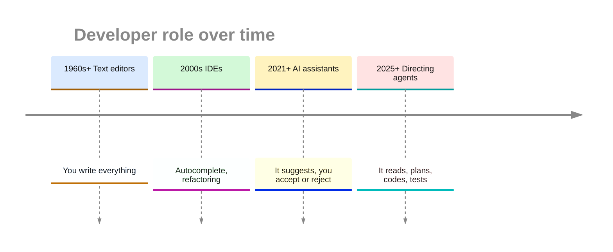
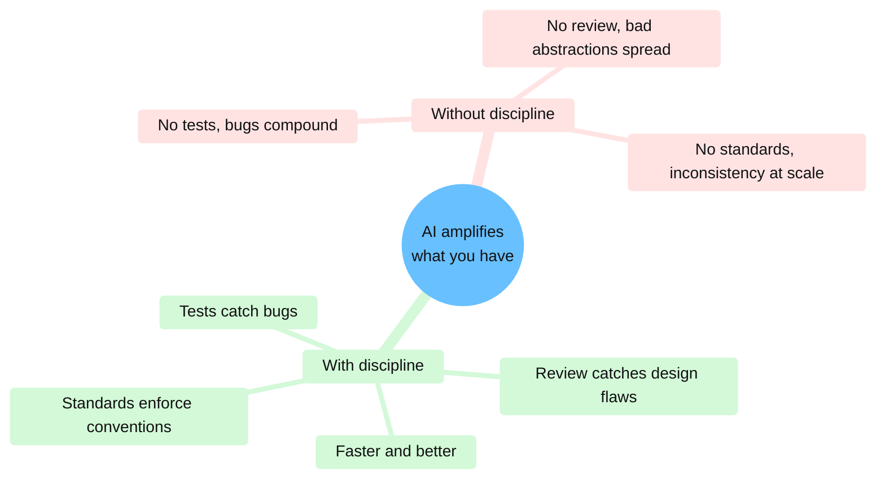

# The gap is the job

System design, business context, edge cases, and review as mentorship.

<!--
Producing code got cheap and proving it correct still costs what it did, so you now spend more of
your time on the proving. In the abstract I promised four skills for that work: system design,
business context, edge-case reasoning, and code review as mentorship. I take them one at a time
here, and I cover the review mechanics, the passes and the checklist, in the next section.
-->

---

# <mdi-swap-vertical class="text-blue-500" /> The Role is Shifting Up

 <mdi-account-check class="text-3xl text-green-500" />
 
<strong>You decide and verify</strong>1

 <mdi-lightning-bolt class="text-3xl text-orange-500" />
 
<strong>The capable middle keeps widening</strong>

1 <a href="https://www.normaltech.ai/p/why-ai-hasnt-replaced-software-engineers" target="_blank" rel="noopener">Narayanan and Kapoor: why AI has not replaced software engineers</a>, Jun 2026

<!--
At each step in this timeline the tool took more of the typing and the person needed more judgment:
you wrote everything, then the IDE completed names, then an assistant suggested lines, and now an
agent reads, plans, writes and tests on its own.

Arvind Narayanan and Sayash Kapoor describe the work as a sandwich. You decide what to build,
something executes it, and you deliver it. Agents compress the middle layer, while you keep the two
outer layers and spend a larger share of your day on them.

An agent today finishes tasks it failed at three months ago, so the middle keeps widening and you
have to keep redrawing the line between what you delegate and what you own.
-->

---

# <mdi-sitemap class="text-orange-500" /> Own the One-Way Doors; Delegate the Rest

pipdeptree: I fixed the extension boundary and output contract before any Rust.

Weak abstractions spread: duplicate patterns, workaround fields, untraceable request paths.1

<strong>Own:</strong> schemas, service boundaries, core abstractions. <strong>Delegate:</strong> the rest, with a tight
spec.1

1 <a href="https://boristane.com/blog/slop-creep-enshittification-of-software" target="_blank" rel="noopener">Boris Tane: Slop Creep</a>, Mar 2026

<!--
The engineer keeps system design. You saw pipdeptree at the start, where I picked the extension
boundary and the output contract before the agent wrote any Rust. I made the Python API the safe
boundary, so Rust could replace the engine as long as the same inputs produced the same dependency
tree. With those two choices I gave the agent plenty of room and kept the public behaviour out of
its reach.

Writing code by hand used to be slow enough that you noticed a weak abstraction before many features
depended on it. An agent can copy the same mistake across a codebase before the team feels the cost.
Boris Tane watched his side project reach that point in days.

[click] He lists the symptoms: six different ways to do the same thing, schema fields that exist
only to work around the original schema, request flows no one can trace, and a heavier on-call
load.

[click] His fix, and mine, is a division of labour. You own the decisions that are expensive to
reverse, which he calls the one-way doors: data models, service boundaries, core abstractions. Once
ten features sit on a bad schema, you pay for the migration. The agent gets the rest, with a scope
tight enough that it cannot slip an architectural choice past you.
-->

---

# <mdi-briefcase class="text-blue-500" /> Business Context Lives Outside the Training Data

Your billing rules · the downstream tool that depends on your bug

<strong>virtualenv 20.33.0, Aug 2025:</strong> agent-assisted fix with a test1 → 5 hours
later, "breaks Poetry in GitHub Actions"2 → Poetry relied on the old behaviour3

20.33.0 shipped 3 Aug 2025, Poetry re-allowed it 16 Aug · filelock: 2019 comment on issue 27, deletion Feb 2026, reverted Jul 20264

1 <a href="https://github.com/pypa/virtualenv/pull/2921" target="_blank" rel="noopener">virtualenv #2921</a>, Aug 2025, three commits by Google's Jules agent

2 <a href="https://github.com/pypa/virtualenv/issues/2931" target="_blank" rel="noopener">virtualenv #2931</a>, 3 Aug 2025

3 <a href="https://github.com/python-poetry/poetry/pull/10506" target="_blank" rel="noopener">poetry #10506</a>, Aug 2025

4 <a href="https://github.com/tox-dev/filelock/pull/577" target="_blank" rel="noopener">filelock #577</a>, 2 Jul 2026

<!--
Public training data holds Stack Overflow answers and public code, so the model did not learn your
billing rules or the tool downstream that depends on your bug.

The agent writes what you describe. It does not know the regulation the code has to satisfy or why
the previous team avoided the obvious design. You and your teammates hold that knowledge.

[click] Last year a virtualenv contributor used Google's Jules agent to fix a real bug: an absolute
path passed to --python lost to --try-first-with. The fix was correct and came with a test, and I
merged it. Five hours after the release, someone filed an issue titled "virtualenv 20.33.0 breaks
Poetry in GitHub Actions". Poetry had adopted --try-first-with as a workaround for the old
behaviour, so their users' CI started running on the system Python. We had no way to see from our
repository that another tool depended on the bug. Poetry switched to --python and allowed the new
release again later that month.

filelock has a quieter version of the same story. An old issue comment explains why the Unix lock
file stays on disk after release. A contributor changed the release path to delete it and avoid
orphan files, and that change broke mutual exclusion for four and a half months. Reviewers could not
see the old reason in the diff.
-->

---

# <mdi-target-variant class="text-red-500" /> Edge Cases: Plausible is Not Correct

SQLite clone: passed its tests, 20,171x slower1

Vjeux: ~100k lines to Rust, 1 month, 5,000 commits2

"a smart student that is trying to find every opportunity to avoid doing the hard work…"

Make correctness machine-checkable: a failing test · a diff against a reference

Vjeux's harness: 80 divergences left in 2.4M seeds

1 <a href="https://blog.katanaquant.com/p/your-llm-doesnt-write-correct-code" target="_blank" rel="noopener">Your LLM does not write correct code</a>, Mar 2026

2 <a href="https://blog.vjeux.com/2026/analysis/porting-100k-lines-from-typescript-to-rust-using-claude-code-in-a-month.html" target="_blank" rel="noopener">Vjeux: porting 100k lines to Rust</a>, Jan 2026

<!--
Edge-case reasoning is the third of the four. An agent produces code that looks right, which is
enough on the happy path; you find the difference between plausible and correct in the edge cases.
One write-up this year described an LLM-built SQLite clone that passed its tests and ran 20,171
times slower than the original.

Vjeux, who was on the original React Native team and took Prettier from prototype to wide use,
ran Claude Code around the clock to port about a hundred thousand lines of Pokemon Showdown to Rust, and he published a write-up.

[click] In his words, "Claude Code is like a smart student that is trying to find every opportunity
to avoid doing the hard work and take the easy way out if it thinks it can get away with it." The
agent takes the shortest path to something that looks finished.

[click] His answer was to make correctness checkable by a machine. He split each method into its own
file, placed the original JavaScript next to each Rust method as comments, and ran a harness that
fed the same random seeds to both versions and compared the results. 80 divergences remained in
2.4 million seeds. Give the agent a failing test or a reference to diff against, and you see each
shortcut as a broken build before it ships.
-->

---

# <mdi-school class="text-green-500" /> Review Hands Over the Context the Agent Lacks

Learning a library with AI: quiz −17%, n=52; asking for explanations kept the learning1

Do it twice: by hand, then by agent2

Cognitive debt3 · understanding is the bottleneck4

<strong>In review:</strong> the author explains the change; the reviewer writes the why.

1 <a href="https://arxiv.org/abs/2601.20245" target="_blank" rel="noopener">Shen and Tamkin: how AI impacts skill formation</a>, Jan 2026, Anthropic authors

2 <a href="https://mitchellh.com/writing/my-ai-adoption-journey" target="_blank" rel="noopener">Mitchell Hashimoto: my AI adoption journey</a>, Feb 2026

3 <a href="https://www.thoughtworks.com/radar/techniques/codebase-cognitive-debt" target="_blank" rel="noopener">Thoughtworks Radar: codebase cognitive debt</a>, Apr 2026

4 <a href="https://geoffreylitt.com/2026/07/02/understanding-is-the-new-bottleneck" target="_blank" rel="noopener">Geoffrey Litt: understanding is the new bottleneck</a>, Jul 2026

<!--
Code review as mentorship is the last of the four. In review, a senior engineer explains why the obvious fix is wrong in this codebase. With an agent writing the first draft, that
explanation has two audiences: the person who prompted the agent, and the next person who reads the
code.

Delegation has a measurable cost for learning. Judy Hanwen Shen and Alex Tamkin, both working with
Anthropic, randomised 52 people learning an unfamiliar Python library, with GPT-4o chat as the
assistant. The AI group scored 17% lower on the quiz afterwards, and the largest gap was in
debugging. The participants who asked for explanations or conceptual answers kept their learning. It
is one small, short study, so give it the weight of a single data point.

Mitchell Hashimoto describes a habit for learning a new area: do the task by hand, then have the
agent reproduce it, and compare the two. He did the work twice, and says that is how he built the
expertise.

Thoughtworks put "codebase cognitive debt" on its April radar: the gap between what a system does
and what the team understands about why. Geoffrey Litt argues that understanding is now the
bottleneck, because you need it to keep contributing as well as to verify.

[click] You can take two review habits from this. Ask the author to explain the agent's change in
their own words; if they cannot, the review is not done. When you reject something, write down the
why along with the fix, because that sentence is the part a teammate learns from. Josh Schneider
covered the human side of mentoring in his talk earlier today.
-->

---

# <mdi-trending-up class="text-orange-500" /> AI Amplifies What You Already Have

Strong practices: faster good code. Weak practices: a debt accelerator.1

Engineering practices first, agent second.2

1 <a href="https://martinfowler.com/fragments/2026-02-18.html" target="_blank" rel="noopener">Rachel Laycock (Thoughtworks), quoted by Martin Fowler</a>, Feb 2026

2 <a href="https://dora.dev/dora-report-2025/" target="_blank" rel="noopener">DORA 2025: State of AI-assisted Software Development</a>, Sep 2025

<!--
In February Martin Fowler quoted Rachel Laycock of Thoughtworks, who said that with good practices
the agent speeds up good work and with weak ones it becomes a debt accelerator, producing more bad
code faster.

[click] Google's DORA team reached the same conclusion from about five thousand survey responses and
called AI an amplifier of the strengths and dysfunctions a team already has. Put engineering
practices first and the agent second; I cover those practices in the next section.
-->
