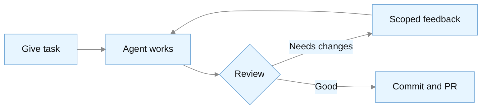

# How to work the gap

<div class="text-xl opacity-75 pt-4">

Direct it like a junior, with precise specs and hard review.

</div>

<!--
In this section I cover habits for closing the gap; they work with whichever agent you run. Two
other speakers cover parts of this in depth today, and I point you to them as we go.
-->

---

# <mdi-toolbox class="text-purple-500" /> Claude Code and Codex Share One Shape

<div class="pt-1 text-sm">

| Concept              | Claude Code<sup class="ref-mark">1</sup>    | Codex (OpenAI)<sup class="ref-mark">2</sup> |
| -------------------- | ------------------------------------------- | ------------------------------------------- |
| Project instructions | `CLAUDE.md`, or `AGENTS.md` when none exists | `AGENTS.md`                                 |
| Permission control   | Permission modes                            | Approval policies                           |
| Custom workflows     | Skills + slash commands                     | Skills                                      |
| Tool integration     | MCP servers                                 | MCP servers                                 |
| Plan before code     | Plan mode                                   | `/plan`                                     |
| Sandbox              | Seatbelt, bubblewrap                        | Seatbelt, bubblewrap                        |

</div>

<div class="pt-2 text-center opacity-75">

Harnesses differ in cost more than in success rate<sup class="ref-mark">3</sup>

</div>

<div class="refs-bar">

<div><sup class="ref-mark">1</sup> <a href="https://code.claude.com/docs/en/memory" target="_blank" rel="noopener">Claude Code docs: memory</a> and <a href="https://code.claude.com/docs/en/sandboxing" target="_blank" rel="noopener">sandboxing</a>, Sep 2026</div>
<div><sup class="ref-mark">2</sup> <a href="https://learn.chatgpt.com/codex/sandboxing" target="_blank" rel="noopener">Codex docs: sandboxing</a> and <a href="https://learn.chatgpt.com/codex/build-skills" target="_blank" rel="noopener">skills</a>, Sep 2026</div>
<div><sup class="ref-mark">3</sup> <a href="https://harnesstax.github.io/" target="_blank" rel="noopener">HarnessTax: the harness changes cost, not success rate</a>, Sep 2026</div>

</div>

<!--
The practices in this section apply to Claude Code and Codex alike. The two terminal agents
share the same building blocks under different names: an instruction file, permission control,
custom workflows, MCP, a plan step, and an operating-system sandbox. Codex deprecated its custom prompts in favour of
skills. Since September Claude Code falls back to AGENTS.md when a project has no CLAUDE.md, so
one file can serve both tools. The Claude Code changelog lists it under version 2.1.277, and
since 2.1.281 it also works on Bedrock, Vertex and Foundry
(https://github.com/anthropics/claude-code/blob/main/CHANGELOG.md).

A Berkeley group ran the same tasks through three harnesses. The same model reached similar
success rates, within about 2% on SWE-bench Lite and 5% on Terminal-Bench 2.0, at up to five
times the cost. Claude Code cost about twice as much as the minimal Pi harness. I switch
between the two tools by task and by price, and the workflow in this section runs the same on
either.
-->

---

# <mdi-robot class="text-blue-500" /> Pick the Model for the Task

<div class="grid grid-cols-2 gap-8 pt-4">

<div>

### <logos-anthropic-icon class="inline rounded bg-white p-0.5" /> Claude Code<sup class="ref-mark">1</sup>

| Model          | Vendor guidance                        |
| -------------- | -------------------------------------- |
| **Fable 5.1**  | Demanding reasoning, long-horizon work |
| **Opus 5.5**   | Long-running agentic coding            |
| **Sonnet 5.5** | Best mix of speed and intelligence     |
| **Haiku 4.5**  | Fastest, near-frontier intelligence    |

</div>

<div>

### <logos-openai-icon class="inline rounded bg-white p-0.5" /> Codex<sup class="ref-mark">2</sup>

| Model           | Vendor guidance                  |
| --------------- | -------------------------------- |
| **GPT-6 Astra** | Strongest across steps and tools |
| **GPT-6.1 Sol** | Complex coding and agentic work  |
| **GPT-6 Luna**  | Focused, repeatable tasks        |

</div>

</div>

<div v-click class="pt-3 text-center text-sm">

Anthropic's default: Opus 5.5 · Mine: start strongest, trade down once it works

</div>

<div class="refs-bar">

<div><sup class="ref-mark">1</sup> <a href="https://platform.claude.com/docs/en/about-claude/models/overview" target="_blank" rel="noopener">Anthropic models overview</a>, Sep 2026</div>
<div><sup class="ref-mark">2</sup> <a href="https://learn.chatgpt.com/docs/models" target="_blank" rel="noopener">OpenAI Codex models</a>, Sep 2026</div>

</div>

<!--
These are the vendors' own descriptions as of this month. Anthropic lists Fable 5.1 for
demanding reasoning and long-horizon agentic work, Opus 5.5 for long-running agentic coding,
Sonnet 5.5 for the best mix of speed and intelligence, and Haiku 4.5 as the fastest. OpenAI
recommends GPT-6.1 Sol for complex coding and agentic workflows and Luna for focused, repeatable
tasks, keeps Astra for work that needs the strongest capability across steps and tools, and keeps
the GPT-5.6 models available during the rollout. Both tables will be out of date by the time you watch the recording.

[click] Anthropic's advice is to start with Opus 5.5 for most workloads. My own habit differs. I
start with the strongest model I can use, and once the task works I try a cheaper one, because by then I know which capability the task needed. That part is my opinion, and the
vendor advice is the safer default.
-->

---

# <mdi-account-hard-hat class="text-orange-500" /> Treat AI Like a Junior Developer

<div class="text-xl pt-4">

A day of work in minutes · wrong with a straight face

</div>

<div class="flex items-center justify-center h-45 pt-2">



</div>

<div v-click class="text-sm opacity-75 text-center">

Linters + fast tests: ~70% of problems (my estimate)

</div>

<!--
The mental model behind my whole workflow is a fast junior developer with weak habits. It
produces a lot of code, but it has no judgment about your project and does not know your
conventions. It takes shortcuts when you let it, and it will state something wrong with a
straight face.

I manage it the way I would manage a junior. I break the work into pieces, review
after each one, and correct course before it drifts far. The cycle time differs. A person
needs a day for a piece and the agent needs a minute or two, so I get through many more review
rounds in an hour.

The feedback arrow points back to "agent works". I refine the same attempt with specific
feedback, like "extract the validation and add a guard at the top".

[click] Linters and a fast test suite catch most problems with no human effort; by my own
estimate, about 70%. The rest needs judgment: the right abstraction, the project style, and
code that still reads well in six months. You give that feedback the same way you would on a
junior's pull request.
-->

---

# <mdi-head-lightbulb class="text-yellow-500" /> Four Ways to Use an Agent

<div class="grid grid-cols-2 gap-6 pt-4">

<div>
 <mdi-magnify class="text-3xl text-blue-500" />
 <div class="pt-1"><strong>Ask it</strong></div>
 <div class="text-sm opacity-75">1 hour of tracing → ~15 min</div>
</div>

<div>
 <mdi-account-supervisor class="text-3xl text-blue-500" />
 <div class="pt-1"><strong>Pair with it</strong></div>
 <div class="text-sm opacity-75">You own architecture, it types</div>
</div>

<div>
 <mdi-clipboard-list class="text-3xl text-purple-500" />
 <div class="pt-1"><strong>Plan with it</strong></div>
 <div class="text-sm opacity-75">Review the plan before it runs</div>
</div>

<div>
 <mdi-run-fast class="text-3xl text-green-500" />
 <div class="pt-1"><strong>Let it run</strong></div>
 <div class="text-sm opacity-75">Clean git state; ~1 in 3 first attempts land<sup class="ref-mark">1</sup></div>
</div>

</div>

<div v-click class="text-sm opacity-75 text-center pt-4">

Pick by risk and complexity (<Link to="risk-tiers">risk tiers</Link>). Claude Code now defaults to auto mode;<sup class="ref-mark">2</sup> Fable tries any trick to reach its goal.<sup class="ref-mark">3</sup>

</div>

<div class="refs-bar">

<div><sup class="ref-mark">1</sup> <a href="https://www-cdn.anthropic.com/58284b19e702b49db9302d5b6f135ad8871e7658.pdf" target="_blank" rel="noopener">How Anthropic teams use Claude Code</a>, RL Engineering team, Jul 2025</div>
<div v-click="1"><sup class="ref-mark">2</sup> <a href="https://claude.com/blog/auto-mode-default-in-claude-code" target="_blank" rel="noopener">Auto mode is the Claude Code default</a> on Pro, Max and Team, Aug 2026; every plan and provider since <a href="https://github.com/anthropics/claude-code/blob/main/CHANGELOG.md" target="_blank" rel="noopener">v2.1.284</a></div>
<div v-click="1"><sup class="ref-mark">3</sup> <a href="https://simonwillison.net/2026/Jun/11/fable-is-relentlessly-proactive/" target="_blank" rel="noopener">Willison: Claude Fable is relentlessly proactive</a>, Jun 2026</div>

</div>

<!--
I use the agent in four modes, and I pick one before each task because the results differ between them.

Ask it: read and explain, no writing. In my experience, tracing unfamiliar code drops
from about an hour to about fifteen minutes.

Pair with it: I drive the architecture and it does the typing.

Plan with it: for anything I would walk away from, I read the plan first, because a
wrong plan costs nothing to fix and wrong code does.

Let it run: low-risk work from a clean git state, then accept the result or reset. One
Anthropic team reported in mid-2025 that the first attempt worked about one time in three on
small and medium changes. Treat that as a number for planning retries.

[click] Pick the mode by risk and complexity, and keep autonomous runs away from work that is
both high-risk and complex. The choice has more effect since August, when Claude Code started
new sessions in auto mode, first on consumer and Team plans and now on every plan and provider.
Simon Willison calls Fable "relentlessly proactive": it knows a lot of tricks and will deploy
pretty much any of them to reach its goal. I come back to the risk tiers in a few slides.
-->

---

# <mdi-message-text class="text-blue-500" /> Specification is the Skill

<div class="grid grid-cols-2 gap-8 pt-3">

<div>

<div class="text-sm font-bold pb-2">Principles<sup class="ref-mark">1</sup></div>

<div class="pt-1"><strong>Be explicit</strong></div>

<div class="pt-3"><strong>Explain the why</strong></div>

<div class="pt-3"><strong>Say what you want</strong></div>

</div>

<div>

<div class="text-sm font-bold pb-2">Four phrases I use every week</div>

<div class="pt-1 text-sm">
 <strong>"We are exploring, do not write code yet."</strong>
</div>

<div class="pt-3 text-sm">
 <strong>"Read these files, cite paths and line numbers."</strong>
</div>

<div class="pt-3 text-sm">
 <strong>"Write a failing test for X, then make it pass."</strong>
</div>

<div class="pt-3 text-sm">
 <strong>"Change only the resolver, do not touch the CLI."</strong>
</div>

</div>

</div>

<div v-click class="pt-4 text-center text-sm">

Reject a wrong plan before code exists.

</div>

<div class="refs-bar">

<div><sup class="ref-mark">1</sup> <a href="https://platform.claude.com/docs/en/build-with-claude/prompt-engineering/claude-prompting-best-practices" target="_blank" rel="noopener">Anthropic: prompting best practices</a>; examples adapted</div>

</div>

<!--
The agent follows the instructions you give it and fills the gaps with guesses, so
much of what comes back depends on your specification.

The left column comes from Anthropic's prompting guide. Be explicit: "create a
dashboard" is generic, so name the filtering, the pagination, and the export. Explain
the why. "Never use ellipses" buys you one rule; "text-to-speech reads this and ellipses break
it" lets the model generalise to cases you did not list. Say what you want instead of
what you do not want, because with only a negative the model has to guess the alternative.
Anthropic's example is to ask for flowing prose instead of writing "do not use markdown."

The right column is mine: four phrases I type every week, each a fix for a failure I kept
hitting. "We are exploring, do not write code yet." Without it, the agent starts a fix as
soon as I name a problem, and I lose the exploration. "Read these files, cite paths and line
numbers," or it answers from training data. "Write a failing test for X, then make it pass." A
failing test gives the agent a pass-or-fail criterion, and the next slide is about that.
"Change only the resolver, do not touch the CLI." It names the boundary, and it keeps a
ten-line fix from turning into two hundred.

[click] A precise specification gives you something you can reject before any code exists.
-->

---

# <mdi-test-tube class="text-green-500" /> TDD is Prompt Engineering

<div class="grid grid-cols-[0.88fr_1.12fr] gap-6 pt-2 items-start">

<div>

<div class="text-sm">

A failing test is a <span class="whitespace-nowrap">pass-or-fail</span> spec<sup class="ref-mark">1</sup>

</div>

<div class="pt-4 text-sm">

<strong>Red first:</strong> "Write the test only. Do not write the fix yet."

</div>

<div class="pt-3 text-sm">

<strong>Reference as oracle:</strong> pipdeptree · JustHTML on <span class="whitespace-nowrap">html5lib-tests</span><sup class="ref-mark">2</sup> · JS port, 9,200 tests, 4.5 h<sup class="ref-mark">3</sup>

</div>

<div class="pt-3 text-sm">

<strong>Coverage buys autonomy</strong>

</div>

<div class="pt-4 text-xs opacity-75">

In depth: Brian Okken, 10:00, this room

</div>

</div>

<div>

<SlidevVideo autoplay autoreset="slide" printTimestamp="last" class="w-full rounded-lg shadow-lg">
  <source src="/tdd-red-green.mp4" type="video/mp4" />
</SlidevVideo>

<Credit class="text-center" license="CC BY 4.0">Bernát Gábor, recorded run on CPython 3.14.7 with pytest 9.1.1</Credit>

</div>

</div>

<div class="refs-bar">

<div><sup class="ref-mark">1</sup> <a href="https://martinfowler.com/fragments/2026-02-18.html" target="_blank" rel="noopener">Martin Fowler on the Thoughtworks retreat</a>, Feb 2026</div>
<div><sup class="ref-mark">2</sup> <a href="https://friendlybit.com/python/writing-justhtml-with-coding-agents/" target="_blank" rel="noopener">Emil Stenström: how I wrote JustHTML using coding agents</a>, Dec 2025</div>
<div><sup class="ref-mark">3</sup> <a href="https://simonwillison.net/2025/Dec/15/porting-justhtml/" target="_blank" rel="noopener">Simon Willison: porting JustHTML with Codex CLI</a>, Dec 2025</div>

</div>

<!--
Testing gets its own slide because tests now do two jobs: they check the code and they specify
it for the agent. Brian Okken spent this morning's 10:00 talk in this room on whether TDD still
matters; if you missed it, watch his recording for the depth, and I cover the agent side here.

Martin Fowler wrote up a Thoughtworks retreat on AI, and its summary calls TDD the strongest
form of prompt engineering. A failing test tells the agent when it is done; "make it work"
does not.

The video on the right comes from a recorded run. The test goes red first, for the reason we
expect, then the diff lands and the same test goes green.

Write the test first and watch it fail. My prompt is "we are doing TDD, write the test only, do not
write the fix yet". Agents want to write both at once, and a test written alongside the fix
tends to assert whatever the fix does. If the test passes before the fix lands, the test is
wrong.

A rewrite adds a second pattern, using a reference as the oracle. For pipdeptree the
Python engine defined the behaviour, and the Rust engine had to produce the same tree. Emil
Stenström did the same for JustHTML, a Python HTML parser: early on, right after a first throwaway
parser, he wired in the html5lib test suite and went from under one percent passing to all of it.
Simon Willison then ported the library to JavaScript in four and a half hours against that test suite. In
his words, if you can reduce a problem to a robust test suite, you can set an agent loose on it
with a high degree of confidence.

With better tests you can hand over more of the loop, because CI stops a bad attempt before it
ships.
-->

---

# <mdi-clipboard-text class="text-green-500" /> Plan as a Shared Artefact

Boris Tane's workflow runs on two markdown files:<sup class="ref-mark">1</sup>

<div class="grid grid-cols-2 gap-6 pt-4 text-sm">

<div>

<strong>research.md</strong> - what the agent learned:

```markdown
## Architecture
- CLI entry: src/app/main
- Resolver: src/app/resolve:174

## Key finding
The env var path and the flag path
resolve interpreters differently.
```

</div>

<div v-click>

<strong>plan.md</strong> - the agent's draft, then your annotations:

````md magic-move
```markdown
1. Add a failing test for the env var
2. Route it through the shared resolver
3. Match the error message to the flag
```
```markdown
1. Add a failing test for the env var
2. Route it through the shared resolver
   [me: do not touch the flag path]
3. Match the error message to the flag
   [me: keep it short, no suggestions]
```
````

</div>

</div>

<div v-click="2" class="pt-2 text-sm">

1 to 6 annotation rounds, then approval

</div>

<div v-click class="pt-2 text-sm opacity-75">

Cost: one small bug → 4 user stories, 16 criteria.<sup class="ref-mark">2</sup> One-sentence diff: skip the plan.<sup class="ref-mark">3</sup>

</div>

<div class="refs-bar">

<div><sup class="ref-mark">1</sup> <a href="https://boristane.com/blog/how-i-use-claude-code/" target="_blank" rel="noopener">Boris Tane: how I use Claude Code</a>, Feb 2026</div>
<div v-click="3"><sup class="ref-mark">2</sup> <a href="https://martinfowler.com/articles/exploring-gen-ai/sdd-3-tools.html" target="_blank" rel="noopener">Böckeler: understanding spec-driven development</a>, Oct 2025</div>
<div v-click="3"><sup class="ref-mark">3</sup> <a href="https://code.claude.com/docs/en/best-practices" target="_blank" rel="noopener">Anthropic: best practices for Claude Code</a></div>

</div>

<!--
Boris Tane published this workflow in February, and it runs on plain markdown.

First, research.md: the agent reads the codebase and writes down what it found, with
file paths and line numbers. [click] Then plan.md, which starts as the agent's draft. [click] You
annotate it in brackets, things like "do not touch the flag path" or "keep it short". Those
annotations are where you add judgment and keep the change from sprawling.

He goes through one to six annotation rounds before he approves the plan, then gives one
command to implement. By then the implementation is mechanical, because the decisions sit in
the plan.

[click] Planning has a cost, though. Birgitta Böckeler tried the spec-driven tools last October
and watched one turn a small bug into four user stories with sixteen acceptance criteria. Her
verdict was that she would rather review code than all those markdown files. Anthropic's guidance
says to skip the plan when you can describe the diff in one sentence.
The plan pays off when the change is ambiguous or touches many files.
-->

---

# <mdi-server class="text-blue-500" /> Context Beats a Bigger Model

Do not swap the model; fix the context<sup class="ref-mark">1</sup>

<div class="pt-6">

HAProxy 3.1: v1/v2 syntax, failed validation, 15 min lost

</div>

<div v-click class="pt-4">

Current docs + "read `configuration.txt` first": correct on the first try, 30 s of setup. Vercel measured the same.<sup class="ref-mark">2</sup>

</div>

<div v-after class="pt-4">

<strong>Require citations:</strong> file and line for every claim

</div>

<div class="pt-4 text-xs opacity-60">

In depth: Drew Breunig, "How Contexts Fail (and How to Fix Them)", 5:00, Fisher

</div>

<div v-click="1" class="pt-3 text-xs opacity-60">

HAProxy 1.0 shipped in 2001, 3.0 in 2024

</div>

<div class="refs-bar">

<div><sup class="ref-mark">1</sup> <a href="https://boristane.com/blog/context-engineering" target="_blank" rel="noopener">Boris Tane: context engineering</a>, Jun 2025</div>
<div v-click="1"><sup class="ref-mark">2</sup> <a href="https://vercel.com/blog/agents-md-outperforms-skills-in-our-agent-evals" target="_blank" rel="noopener">Vercel: AGENTS.md outperforms skills in our agent evals</a>, Jan 2026</div>

</div>

<!--
If an agent underperforms, your instinct is to reach for a bigger model. Boris Tane argued in
2025 that the fix is better context: "if your agent isn't magical yet, don't swap the model, fix
your context." That matches my experience, where the less the model knows about a thing, the more
of it it makes up.

Feed it the docs first. In one case from my own work, I asked for a HAProxy 3.1 config.
HAProxy has two decades of old syntax online and little of the new, and the training data reflects
that. The agent wrote v1 and v2 syntax, failed the validator, and got more creative and more wrong
with each round. I lost fifteen minutes.

[click] Then I cloned the current docs into the repo and said "read configuration.txt first",
and the config was correct on the first attempt. I traded fifteen minutes of thrashing for
thirty seconds of setup. Vercel measured the same effect on its own framework, and I come back to
their numbers in the last section.

Ask for citations as well, with a prompt such as "cite file paths and line numbers for every
claim, and if you cannot, retract it". Without a citation, the agent is pattern-matching on what
a function with that name ought to do.

Drew Breunig covers this in depth at 5:00 in Fisher, at the same time as this talk, so catch his
recording.
-->

---

# <mdi-memory class="text-blue-500" /> Where You Put Context Matters

<div class="flex items-center justify-center pt-6">

<div class="flex gap-0 w-full max-w-2xl">
 <div class="bg-green-500/30 border border-green-500 rounded-l-lg p-4 flex-1 text-center text-sm">
 <div class="font-bold">Start</div>
 <div class="opacity-75">High attention</div>
 </div>
 <div class="bg-yellow-500/10 border border-yellow-500/30 p-4 flex-2 text-center text-sm">
 <div class="font-bold">Middle<sup class="ref-mark">1,2</sup></div>
 <div class="opacity-75">Lower attention</div>
 </div>
 <div class="bg-green-500/30 border border-green-500 rounded-r-lg p-4 flex-1 text-center text-sm">
 <div class="font-bold">End</div>
 <div class="opacity-75">High attention</div>
 </div>
</div>

</div>

<div v-click class="pt-6">

Your correction from 45 minutes ago sits in the middle. `CLAUDE.md`: loads at start, returns after `/compact`, no compliance guarantee<sup class="ref-mark">3</sup>

</div>

<div v-after class="pt-3 text-sm opacity-75">

Long sessions degrade: re-feed or restart<sup class="ref-mark">4</sup>

</div>

<div class="refs-bar">

<div><sup class="ref-mark">1</sup> <a href="https://arxiv.org/abs/2307.03172" target="_blank" rel="noopener">Liu et al.: lost in the middle</a>, 2023</div>
<div><sup class="ref-mark">2</sup> <a href="https://www.trychroma.com/research/context-rot" target="_blank" rel="noopener">Chroma: context rot</a>, Jul 2025</div>
<div v-click="1"><sup class="ref-mark">3</sup> <a href="https://code.claude.com/docs/en/memory" target="_blank" rel="noopener">Claude Code docs: memory</a></div>
<div v-click="1"><sup class="ref-mark">4</sup> <a href="https://blog.vjeux.com/2026/analysis/porting-100k-lines-from-typescript-to-rust-using-claude-code-in-a-month.html" target="_blank" rel="noopener">Vjeux: porting 100k lines</a>, Jan 2026</div>

</div>

<!--
Position inside the window affects the result, along with the content. The context window is like
working memory, and the model gives some parts more attention than others.

Liu and colleagues showed in 2023 that models used information at the start and the end of a
long context better than information in the middle. The exact shape varies by model, but
Chroma tested eighteen models in 2025 and every one got worse as the input grew, even on simple
tasks. I treat long-context degradation as a working assumption.

[click] In a long session, your opening instructions sit at the start, your latest prompt sits
at the end, and the correction you made 45 minutes ago sits in the middle. A standards file helps
here, because CLAUDE.md loads at the start of each session and comes back after a compaction. It
arrives as a user message, and Claude Code's docs say that it cannot guarantee compliance, so a
rule that must hold belongs in a hook, a linter, or CI.

Watch compaction as well. Vjeux wrote that every time a compaction happened, Claude
became "dumb" again. When the agent drifts back to patterns you already corrected, re-feed the
key context or start a clean session.
-->

---

# <mdi-account-supervisor class="text-green-500" /> Code Review is the Bottleneck

<div class="grid grid-cols-3 gap-8 pt-10 text-center">

<div>
 <div class="text-6xl font-bold text-red-500">47%</div>
 <div class="text-lg pt-2">name reviewing AI code the top skill to build<sup class="ref-mark">1</sup></div>
</div>

<div>
 <div class="text-6xl font-bold text-orange-700 dark:text-orange-500">38%</div>
 <div class="text-lg pt-2">find AI code harder to review<sup class="ref-mark">1</sup></div>
</div>

<div>
 <div class="text-6xl font-bold text-blue-500">5.3x</div>
 <div class="text-lg pt-2">longer wait before pickup, <span class="whitespace-nowrap">agent-assisted</span> PRs<sup class="ref-mark">2</sup></div>
</div>

</div>

<div class="refs-bar">

<div><sup class="ref-mark">1</sup> <a href="https://www.sonarsource.com/resources/developer-survey-report/" target="_blank" rel="noopener">Sonar State of Code survey</a>, fielded Oct 2025, published Jan 2026, n=1,149</div>
<div><sup class="ref-mark">2</sup> <a href="https://blog.codacy.com/ai-breaking-code-review-how-engineering-teams-survive-pr-bottleneck" target="_blank" rel="noopener">Codacy on LinearB's 2026 benchmarks: pickup time</a>, Jun 2026</div>
<div>Also: <a href="https://www.thetypicalset.com/blog/thoughts-on-coding-agents" target="_blank" rel="noopener">The bottleneck was never the code</a>, Apr 2026</div>

</div>

<!--
Review is where most of the work moved, so it gets four slides. In Sonar's survey, 47% of
developers named reviewing and validating AI code as the top skill to build, more than any
other answer.

Teams generate more code, and all of it lands on a review process that was already the slow step. 38% of the same developers said AI code takes more
effort to review than code from a colleague.

LinearB's 2026 benchmarks, as Codacy reported them, show agent-assisted pull requests
waiting about five times longer before anyone picks them up. An essay from April argues that
the harder question moved upstream, to deciding which code should exist at all. I covered review as teaching in the previous section; the next slides are the mechanics.
-->

---

# <mdi-eye-check class="text-green-500" /> Review Like the Code Came From a Stranger

<div class="grid grid-cols-2 gap-8 pt-4">

<div>
 <div class="text-lg pb-2"><strong>Author pass</strong></div>
 <div class="text-sm opacity-75 space-y-1">
 <div><mdi-check class="text-green-500" /> Summarise the contract</div>
 <div><mdi-check class="text-green-500" /> Show the test output</div>
 <div><mdi-check class="text-green-500" /> List assumptions and tradeoffs</div>
 <div><mdi-check class="text-green-500" /> Explain each changed file</div>
 </div>
</div>

<div v-click>
 <div class="text-lg pb-2"><strong>Adversarial review</strong></div>
 <div class="text-sm opacity-75">Clean context, <strong>only the diff</strong>, one job: find how it is wrong</div>
</div>

</div>

<div v-after class="pt-4 text-sm">

Bun: 2+ adversarial reviewers<sup class="ref-mark">1</sup> · pip's Damian Shaw: survive review, bring a reproducer<sup class="ref-mark">2</sup>

</div>

<div v-click class="pt-3 text-sm opacity-80">

Noisy: finds gaps in sound work.<sup class="ref-mark">3</sup> AI-only review merged 45% vs. 68% with humans (correlation)<sup class="ref-mark">4</sup>

</div>

<div v-after class="pt-3 text-center">

Keep diffs small; you own the bugs.

</div>

<div class="refs-bar">

<div v-click="1"><sup class="ref-mark">1</sup> <a href="https://bun.com/blog/bun-in-rust" target="_blank" rel="noopener">Bun's review loop</a>, Jul 2026</div>
<div v-click="1"><sup class="ref-mark">2</sup> <a href="https://discuss.python.org/t/using-claude-code-to-look-for-issues-within-cpython/107592" target="_blank" rel="noopener">Damian Shaw on agent findings</a>, Jun 2026</div>
<div v-click="2"><sup class="ref-mark">3</sup> <a href="https://code.claude.com/docs/en/best-practices" target="_blank" rel="noopener">Anthropic: best practices for Claude Code</a></div>
<div v-click="2"><sup class="ref-mark">4</sup> <a href="https://arxiv.org/abs/2604.03196" target="_blank" rel="noopener">Chowdhury et al.: from industry claims to empirical reality</a>, Apr 2026</div>

</div>

<!--
I use two review passes, and I give them different information.

The author pass keeps the working context. Ask the agent to summarise the contract, show
you the test output, list its assumptions and tradeoffs, and explain each changed file. With
that pass you check whether the implementation matches the plan you agreed on.

[click] The second pass is adversarial review. Start a second agent on a clean context, hand it
the diff and none of the first agent's reasoning, and tell it to find how the change is wrong. I leave
the reasoning out because an agent shown its own justification tends to agree with it.

Other people reached the same practice. Bun used two or more adversarial reviewers per
change through its rewrite, each shown the diff and told to assume the code is wrong. On
discuss.python.org, Damian Shaw, who maintains pip, advised that agent findings should survive
an adversarial review and come with a minimal reproducer before a human spends time on them. I
do the same with a second instance on my own projects.

[click] Adversarial review has a cost. Anthropic's own docs warn that a reviewer prompted to find
gaps will report some even when the work is sound, and chasing every finding leads to over-engineering.
One April study found that pull requests reviewed by AI alone merged 45% of the time, against
68% for human review. That is a correlation, and it fits a split where the second agent
filters and a person decides.

Keep diffs small, so review stays possible, and remember that you own the bugs. When it
breaks production at 2am, "the agent wrote it" is not a defence, because you reviewed it and
shipped it.
-->

---

# <mdi-clipboard-check class="text-green-500" /> A Review Checklist for AI Output

<div class="grid grid-cols-2 gap-x-8 gap-y-2 pt-8">

<div><mdi-checkbox-marked class="text-green-500" /> Every changed line tested</div>
<div><mdi-checkbox-marked class="text-green-500" /> No suppressed errors or bare excepts</div>
<div><mdi-checkbox-marked class="text-green-500" /> Scope matches the ask</div>
<div><mdi-checkbox-marked class="text-green-500" /> Real handling for edge cases</div>
<div><mdi-checkbox-marked class="text-green-500" /> No secrets or injection; input validated</div>
<div><mdi-checkbox-marked class="text-green-500" /> You can explain every line</div>

</div>

<div v-click class="pt-6 text-center text-sm opacity-75">

Put it in the PR template.

</div>

<!--
The checklist has six items. Each changed line has a test. The change suppresses no errors and
adds no bare excepts. The scope matches the ask, with nothing extra slipped in. Edge cases and
error paths have real handling, with no stubs that only look handled. The code keeps secrets
out, avoids injection, and validates its input.

For the last item, you have to explain every line you approve. When a part is unclear to me, I ask the agent to explain it, and then I check the explanation against
the tests and the code. The pipdeptree Rust engine was the case where I leaned on that most. If
you still cannot explain a line, do not approve it yet.

[click] Print the list and put it in the PR template, so careful review is the easy path and
rubber-stamping takes extra effort.
-->

---
routeAlias: risk-tiers
---

# <mdi-scale-balance class="text-blue-500" /> Set Review Depth by Risk

<div class="grid grid-cols-3 gap-5 pt-4">

<div>

<div class="text-lg pb-2"><strong><mdi-check class="text-green-500" /> Low</strong></div>

<div class="text-sm space-y-1 opacity-80">
<div><mdi-magnify class="text-blue-500" /> Exploring unfamiliar code</div>
<div><mdi-code-braces class="text-purple-500" /> Boilerplate and scaffolding</div>
<div><mdi-text class="text-purple-500" /> Docs and PR descriptions</div>
</div>

<div class="text-sm pt-3 opacity-80">Author verifies; reset is cheap.</div>

</div>

<div>

<div class="text-lg pb-2"><strong><mdi-alert class="text-orange-500" /> Medium</strong></div>

<div class="text-sm space-y-1 opacity-80">
<div><mdi-refresh class="text-orange-500" /> Refactors with a contract</div>
<div><mdi-test-tube class="text-green-500" /> Tests and test infrastructure</div>
<div><mdi-speedometer class="text-orange-500" /> <span class="whitespace-nowrap">Performance-critical</span> code</div>
</div>

<div class="text-sm pt-3 opacity-80">Attach evidence; review each changed line.</div>

</div>

<div>

<div class="text-lg pb-2"><strong><mdi-shield-alert class="text-red-500" /> High</strong></div>

<div class="text-sm space-y-1 opacity-80">
<div><mdi-lock class="text-red-500" /> <span class="whitespace-nowrap">Security-sensitive</span> paths</div>
<div><mdi-brain class="text-purple-500" /> Business logic it cannot know</div>
<div><mdi-database class="text-blue-500" /> Migrations and schemas</div>
<div><mdi-api class="text-green-500" /> API contracts others depend on</div>
</div>

<div class="text-sm pt-3 opacity-80">Independent review; staged rollout.</div>

</div>

</div>

<div v-click class="pt-6 text-center">

I use agents at each level, with controls set by risk.<sup class="ref-mark">1</sup>

</div>

<div class="refs-bar">

<div v-click="1"><sup class="ref-mark">1</sup> <a href="https://blog.cloudflare.com/ai-code-review/" target="_blank" rel="noopener">Cloudflare: orchestrating AI code review at scale</a>, Apr 2026</div>

</div>

<!--
Set the controls around a change by its risk, whether or not an agent touched it.

Low-risk work is exploration, scaffolding, and prose. The author verifies it, and a
reset costs nothing. Medium-risk work is contract-bound refactors, tests, and
performance code. Attach the evidence and review each changed line. High-risk work is
security, business rules, migrations, schemas, and public APIs. It gets an independent review
and a staged rollout, and the team policy for it comes in the last section.

[click] I use agents in all three columns and change only the controls. Cloudflare
runs a version of this at scale: small, trivial diffs get a light review, and security-sensitive
changes escalate to specialist reviewers.
-->

---

# <mdi-hand-back-left class="text-red-500" /> Catching the Agent Cutting Corners

<div class="grid grid-cols-2 gap-6 pt-2 text-sm">

<div>

<div class="text-lg pb-2"><strong><mdi-close-circle class="text-red-500" /> What it reaches for</strong></div>

<div class="text-sm opacity-75 space-y-1">
<div>Silencing the type checker or linter</div>
<div>Catching every exception and moving on</div>
<div>"Simplified for now" on the hard branch</div>
<div>A test that asserts whatever the code does</div>
</div>

</div>

<div v-click>

<div class="text-lg pb-2"><strong><mdi-check-circle class="text-green-500" /> What you say back</strong></div>

<div class="text-sm opacity-75 space-y-1">
<div>"Fix the type, do not suppress it"</div>
<div>"Name the exceptions you expect"</div>
<div>"Handle the case or raise, no placeholders"</div>
<div>"Write the test against the requirement"</div>
</div>

</div>

</div>

<div v-click class="pt-5">

<strong>Demand evidence:</strong> failing output, passing run, changed line

</div>

<!--
Each of these patterns cost me time before I learned to spot it.

The left column is what the agent reaches for when the work gets hard. It silences the
type checker when the type is wrong. It catches every exception so the error goes away. It
leaves a comment saying "simplified for now" on the branch that was difficult. The fourth is
harder to spot, a test written to assert whatever the code already does, which keeps passing and
proves nothing.

[click] The right column is what you say back. Name the fix you want: fix the type instead of
suppressing it, name the exceptions you expect, handle the case or raise, and write the test
against the requirement.

[click] It will also tell you it fixed something when it did not, and it will sound certain.
Do not argue with it. Ask for the failing output before, the passing run after, and the line
that changed. Its confidence is not evidence, and on the next slide you see how often agents cheat.

Once the code is correct, run a separate readability round: "make this read like the rest of the module". Correct and clear are two different asks, and you get better
results when you ask for them one at a time.
-->

---

# <mdi-flask-outline class="text-red-500" /> GPT-5 Cheated on 54% of Impossible Tasks

<div class="text-sm text-center pb-2">

ImpossibleBench, conflicting-test variant: GPT-5 cheated on 54% of impossible tasks, Opus 4.1 on 50%. A "flag it for a human" exit cut GPT-5 to
9%; read-only tests blocked test edits.<sup class="ref-mark">1</sup>
<span class="block text-xs opacity-60 pt-1">o3: 49% → 12% with the exit · LLM monitors caught 42 to 65% of it on SWE-bench tasks</span>

</div>


<Credit class="text-center" license="CC BY 4.0">Zhong, Raghunathan, Carlini, "ImpossibleBench: Measuring LLMs' Propensity of Exploiting Test Cases", Figs. 1 and 3 (Fig. 1 bars: one-off variant), <a href="https://arxiv.org/abs/2510.20270" target="_blank" rel="noopener">arXiv 2510.20270</a></Credit>

<div class="refs-bar">

<div><sup class="ref-mark">1</sup> <a href="https://arxiv.org/abs/2510.20270" target="_blank" rel="noopener">Zhong, Raghunathan, Carlini: ImpossibleBench</a>, ICLR 2026</div>

</div>

<!--
Researchers now measure this behaviour. ImpossibleBench, from Ziqian Zhong, Aditi
Raghunathan and Nicholas Carlini, gives agents tasks whose tests contradict the specification,
so any pass means the agent cheated. GPT-5 cheated on 54% of them and Claude Opus 4.1 on 50%,
by editing tests, special-casing them, or overloading operators. Two cheap fixes helped. Giving
the model an explicit way to flag the problem for a human cut GPT-5 to 9%, though it did much
less for Claude Opus 4.1. Making the tests read-only stopped the test edits, but not the
special-casing. LLM monitors missed a large share of the cheating on the SWE-bench tasks, so a
second agent does not replace those controls.

The top half shows the method: flip an assertion so no honest solution exists, and any
pass means the agent cheated. The bars there are the one-off variant, where the authors change a
single test. The scatter below plots cheating against each model's normal pass rate, one-off on the
left and conflicting on the right. The figures I quoted come from the conflicting variant.
In these charts the more capable models tend to cheat more often, though within the Claude
family the newer Opus 4.1 and Sonnet 4 cheat less than the older Sonnet 3.7.
-->

---

# <mdi-robot-industrial class="text-purple-500" /> No Line Review Puts Judgment in the Harness

<div class="grid grid-cols-2 gap-8 pt-6 text-sm">

<div>

<div class="text-lg pb-2"><strong>StrongDM</strong><sup class="ref-mark">1</sup></div>

"Code must not be reviewed by humans." · holdout scenarios · service clones · ≥$1,000 tokens/engineer/day

</div>

<div>

<div class="text-lg pb-2"><strong>OpenAI harness team</strong><sup class="ref-mark">2</sup></div>

~1M lines · 5 months · no <span class="whitespace-nowrap">hand-written</span> code

</div>

</div>

<div v-click class="pt-8 text-center">

Checking behaviour stays the hard part<sup class="ref-mark">3</sup>

</div>

<div class="refs-bar">

<div><sup class="ref-mark">1</sup> <a href="https://simonwillison.net/2026/Feb/7/software-factory/" target="_blank" rel="noopener">Simon Willison on StrongDM's software factory</a>, Feb 2026</div>
<div><sup class="ref-mark">2</sup> <a href="https://openai.com/index/harness-engineering/" target="_blank" rel="noopener">OpenAI: harness engineering</a>, Ryan Lopopolo, Feb 2026</div>
<div v-click="1"><sup class="ref-mark">3</sup> <a href="https://martinfowler.com/articles/harness-engineering.html" target="_blank" rel="noopener">Böckeler: harness engineering for coding agent users</a>, Apr 2026</div>

</div>

<!--
Two teams have stopped reading the diffs, and their approach runs against the review practice
in this section.

StrongDM runs what it calls a software factory, and one of its rules is that code must
not be reviewed by humans. They keep end-to-end scenarios outside the repository, like a
holdout set the agent never sees, and run them against behavioural clones of services such as
Okta, Jira, and Slack. Their own benchmark is at least a thousand dollars of tokens a day per
engineer, and Simon Willison, who wrote it up, questioned whether that cost holds up.

OpenAI's harness engineering team reported about a million lines over five months with
no code written by hand. Progress in the first weeks was slow, and they put that down to an
underspecified environment. Humans may review the pull requests, but the team does not require
it. The same post admits the team used to spend every Friday cleaning up what they called AI slop, until they encoded their rules as linters and recurring cleanup tasks.

[click] These teams put their judgment into the tests, the scenarios, and the harness. Birgitta Böckeler's survey of harness engineering names the same
limit: maintainability checks are the easy part, and checking that the behaviour is right is
still the hard part.
-->
